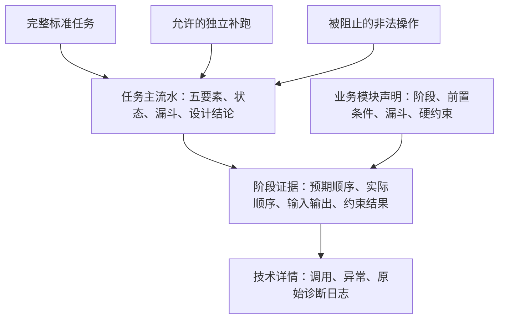
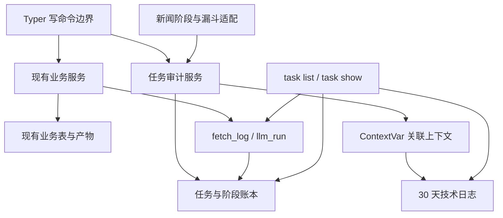
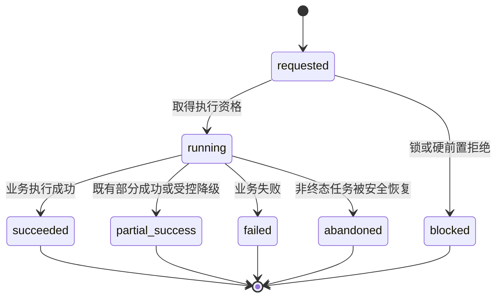
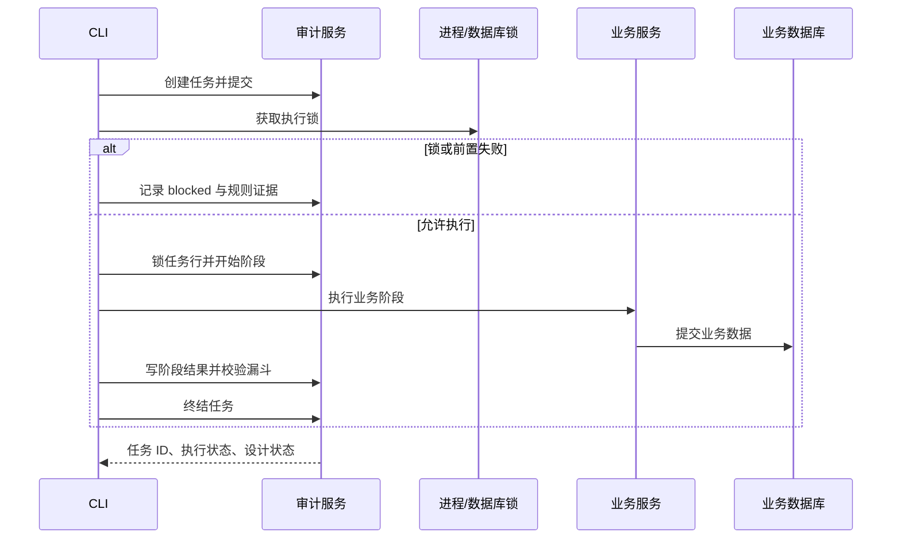

# 统一业务任务审计 - Plan

## Goal Capsule

- **目标：** 建立以任务流水为主线、可验证业务设计、可下钻技术日志的统一业务任务审计能力。
- **权威顺序：** `CLAUDE.md` 与 `新闻采集/CLAUDE.md` > 本文 Product Contract > 本文 Planning Contract > 实施期局部判断。
- **执行范围：** 深度代码计划；在 `新闻采集/` 内新增通用审计能力、数据库迁移、CLI 接入、测试与运行文档，不工程化其他主线模块。
- **停止条件：** 若实现需要改变新闻采集既定业务阶段、固定退出码字面值、产品边界或其他模块工程化边界，停止并回到产品决策层确认。
- **完成归属：** 实施者负责迁移、兼容、测试、文档与运行验证；是否提交、推送或创建 PR 由后续执行工作流决定。

---

## Product Contract

### Summary

建设一套业务无关的任务审计账本，以任务故事、实际阶段顺序、数据漏斗和硬约束校验说明系统实际做了什么、结果如何以及是否符合设计。
新闻采集是第一期唯一接入模块，其他模块以后通过相同的扩展规则接入。

### Problem Frame

现有观测信息分散在任务最终结果、来源级采集记录、LLM 调用记录和滚动文件日志中。
当前 `run` 已生成任务编号和阶段统计，但任务编号没有贯穿各阶段与详细日志，维护者仍需从大量日志中拼接执行过程。
这套留痕可以辅助排障，却不能直接证明阶段是否按设计顺序执行，也不能用统一漏斗解释数据在核心加工过程中去了哪里。

### Key Decisions

- **任务审计账本优先：** 以任务及其有序阶段作为长期事实主线，技术日志只承担下钻解释，不采用完整业务事件溯源。
- **硬约束先于趋势判断：** 第一版自动验证顺序、前置条件、数量守恒和禁止路径，不基于尚未形成的历史基线判断业务比例异常。
- **通用核心、单模块验证：** 核心术语和行为不得依赖文章、来源、事件等新闻概念，但第一期只在新闻采集中验证，不提前抽成仓库级共享组件。
- **审计结果参与任务结论：** 前置或顺序错误在执行前被阻止；执行后发现硬约束违反时，任务必须显示为“设计偏差”，不得显示为成功。

### Actors

- A1. **任务触发者：** 外部定时器、人工操作者或系统补偿动作，负责发起会改变业务状态或产生产物的命令。
- A2. **业务模块：** 声明自己的标准阶段、前置条件、数据漏斗指标和硬约束，并在执行时提供实际证据。
- A3. **维护者：** 先阅读任务主流水判断业务运行是否符合设计，发现偏差后再下钻阶段和技术日志。

### Requirements

**统一任务故事**

- R1. 每个会改变业务状态或产生产物的 CLI 操作必须形成一条独立、可查询的任务流水。
- R2. 每条任务流水必须完整回答五个要素：谁触发、何时发生、操作对象、做了什么、结果如何。
- R3. 完整流水线运行与单阶段命令必须使用同一套任务审计语义，并明确区分标准路径和非标准路径。
- R4. 安全的诊断或补跑可以走非标准路径，但必须记录触发者、补跑原因、操作范围和实际执行顺序。
- R5. 只读查询不进入业务任务主流水，也不得因为查看流水而产生新的业务流水。

**顺序与设计验证**

- R6. 业务模块必须声明标准阶段顺序，任务流水必须同时呈现预期顺序与实际顺序。
- R7. 每个阶段必须留下开始、结束、状态、耗时及前置阶段结论，使维护者可以证明阶段实际发生的先后关系。
- R8. 违反业务正确性的前置条件或禁止路径必须在执行前被阻止，并留下可定位到规则和阶段的审计结论。
- R9. 安全的非标准执行不得伪装成标准流程成功，主流水必须清楚标识其偏离点。
- R10. 执行后发现顺序或数量守恒等硬约束违反时，任务必须标记为“设计偏差”，且最终结论不得为成功。

**核心业务数据漏斗**

- R11. 每个加工阶段必须报告输入、输出、过滤、去重、失败和待处理数量；不适用的去向可省略但不得伪造为零。
- R12. 阶段必须解释数量变化的业务原因，使输入能够与输出及各去向完成数量守恒校验。
- R13. 单任务主视图必须以跨阶段数据漏斗为核心概览，使维护者无需阅读详细日志即可看出数据如何流动。
- R14. 各模块可以声明自己的漏斗指标和业务去向，但必须映射到统一的输入、输出与去向语义。

**分级查看与统一管理**

- R15. 审计信息分为任务主流水、阶段证据和技术详情三级，默认只展示任务故事、漏斗与设计校验结论。
- R16. 维护者必须能通过统一 CLI 先查看任务列表，再查看单任务流水与阶段详情，并可获得等价的机器可读结果。
- R17. 每条阶段证据和相关技术日志必须能够从任务与阶段索引到达，避免依赖时间戳或关键词人工拼接。
- R18. 技术日志的数量和详细程度不得影响主流水可读性，文件日志不得成为判断任务业务结果的唯一事实源。

**跨模块复用与边界**

- R19. 通用任务模型、状态、五要素、阶段关系、验证结果和查看方式不得包含新闻采集领域概念。
- R20. 新业务模块必须能够通过声明业务名称、标准阶段、前置条件、漏斗指标和硬约束接入，而无需改变通用审计语义。
- R21. 第一期仅要求新闻采集的状态变更与产物生成命令完整接入；其他模块只作为通用性检验案例，不实施接入。
- R22. 审计记录与详细日志必须继续遵守现有脱敏和留存约束，不得写入密钥、授权头、Cookie 或未受控的长错误文本。

### Audit Shape



### Key Flows

- F1. **标准完整任务**
  - **触发：** 定时器或操作者启动完整业务流水线。
  - **参与者：** A1、A2、A3。
  - **过程：** 创建任务故事，按声明顺序记录阶段证据，逐阶段汇总数据漏斗并执行硬约束校验。
  - **结果：** 主流水给出完整五要素、最终状态以及“符合设计”或“设计偏差”的结论。
  - **覆盖：** R1–R3、R6–R18。

- F2. **安全的独立补跑**
  - **触发：** 操作者为诊断或补偿执行单阶段命令。
  - **参与者：** A1、A2、A3。
  - **过程：** 校验前置条件，记录补跑原因和范围，并把实际操作标为非标准路径。
  - **结果：** 允许的补跑可以完成，但不会被误读为一次标准完整流水线。
  - **覆盖：** R3、R4、R7–R10。

- F3. **非法顺序被阻止**
  - **触发：** 操作者请求执行会破坏业务正确性的越序操作。
  - **参与者：** A1、A2、A3。
  - **过程：** 在业务动作发生前检查硬前置条件，并记录预期位置、实际请求和阻止规则。
  - **结果：** 任务以失败结束，维护者能从主流水直接定位顺序问题。
  - **覆盖：** R6–R10。

- F4. **从主流水下钻**
  - **触发：** 维护者在任务概览中发现失败、设计偏差或异常漏斗。
  - **参与者：** A3。
  - **过程：** 从任务进入相关阶段，再从阶段进入对应技术详情。
  - **结果：** 排查不需要在无关日志中搜索或人工关联时间戳。
  - **覆盖：** R15–R18。

### Acceptance Examples

- AE1. **标准顺序通过。** 给定业务模块声明阶段 A→B→C，当任务实际按 A→B→C 执行且各阶段数量守恒时，主流水显示“符合设计”。覆盖 R6–R13。
- AE2. **硬前置阻止。** 给定阶段 C 依赖阶段 B 的有效结果，当操作者在 B 未满足时直接执行 C，业务动作不发生，任务失败并指出缺失的前置阶段。覆盖 R8、R10。
- AE3. **安全补跑可追溯。** 给定阶段 B 支持安全补跑，当操作者提供原因并单独执行 B，任务显示为非标准路径且保留操作范围和实际顺序。覆盖 R4、R9。
- AE4. **数量不守恒不得成功。** 给定某阶段输入 100 条，输出及所有去向只能解释 97 条，当任务结束时，主流水显示“设计偏差”并定位缺失的 3 条。覆盖 R10–R13。
- AE5. **只读查看不制造流水。** 当维护者查询任务列表或查看单任务详情时，任务总数与业务状态均不发生变化。覆盖 R5、R16。
- AE6. **通用性检验。** 给定一个非新闻业务案例，它可以使用自己的阶段和漏斗名称描述任务，而无需修改五要素、任务状态、阶段关系或设计校验语义。覆盖 R19–R21。

### Success Criteria

- 维护者通过一次任务查询即可复述完整五要素，不需要先阅读文件日志。
- 标准顺序、实际顺序及每个阶段的前置状态在同一任务视图中可核对。
- 每个核心加工阶段的数据变化都能由输出和明确去向解释，并自动完成数量守恒检查。
- 任一硬约束违反都能在任务主流水中定位到具体阶段和规则，且任务不会显示为成功。
- 新闻采集接入完成后，通用审计契约仍可用一个非新闻业务案例完整表达，不新增领域专用核心概念。

### Scope Boundaries

**第一期包含**

- 通用任务审计语义、分级查看行为、硬约束验证和统一 CLI 体验。
- 新闻采集模块中会改变业务状态或产生产物的命令接入。
- 现有来源采集记录、LLM 调用记录和文件日志通过任务与阶段关联后作为下钻证据继续存在。

**延后处理**

- 其他业务模块的实际接入，以及把通用能力抽成仓库级共享组件。
- 基于历史趋势、比例阈值或统计基线的业务异常判断。
- 图形化后台、告警平台和跨任务分析看板。

**明确排除**

- 把所有只读查询或普通技术调试信息升级为业务任务流水。
- 用完整事件溯源重建全部业务状态。
- 改变新闻采集当前业务阶段、过滤规则或产品边界。

### Dependencies / Assumptions

- 第一阶段继续遵守“仅新闻采集获准工程化”的仓库边界，通用能力先在该模块内验证。
- 各业务模块拥有自己标准顺序与业务约束的定义权；通用核心只负责一致表达、校验和查看。
- 详细日志写入失败不得伪造成功的审计结论；已提交业务数据如何恢复或补记由实现规划明确。
- 现有 30 天文件日志与 LLM 原始响应留存规则继续有效；任务审计证据的具体留存周期在规划阶段确定。

### Sources / Research

- `新闻采集/src/news_ingestion/services/run_service.py`：现有任务编号、固定执行顺序、阶段统计和最终摘要。
- `新闻采集/src/news_ingestion/models/fetch_log.py`：现有来源级采集留痕。
- `新闻采集/src/news_ingestion/models/llm_run.py`：现有 LLM 调用级留痕与留存约束。
- `新闻采集/src/news_ingestion/logging_setup.py`：现有文件与控制台日志配置。
- `新闻采集/src/news_ingestion/cli.py`：现有任务入口、只读观测命令和机器可读输出。
- `新闻采集/CLAUDE.md`：唯一工程化模块边界、固定业务执行顺序、脱敏和留存约束。

---

## Planning Contract

### Product Contract Preservation

Product Contract unchanged：R1–R22、A1–A3、F1–F4 与 AE1–AE6 全部保留；本节只确定实现方式。

### Technical Baseline

- Python 3.12，依赖与命令继续由 `新闻采集/pyproject.toml`、`新闻采集/uv.lock` 和 uv 管理。
- 当前锁定 SQLAlchemy 2.0.51、Alembic 1.18.5、Typer 0.26.8、pytest 9.1.1，不新增审计或日志第三方依赖。
- Supabase Postgres 是唯一生产运行库；SQLite 继续承担默认离线测试，Postgres 专属并发与约束行为使用显式 live 集成测试验证。
- 外部 cron 继续调用一次性 CLI；不增加常驻进程、后台服务、消息队列或调度器。

### Key Technical Decisions

- **通用核心留在现有包内：** 在 `新闻采集/src/news_ingestion/audit/` 建立业务无关的契约、校验和上下文能力，新闻阶段声明作为适配层存在；核心不得导入文章、来源或事件模型。
- **关系列承载主索引，JSON 承载扩展快照：** 任务状态、模块、操作、顺序、时间和设计结论使用可查询列；范围、模块指标、前置证据和校验详情使用整体替换的 JSON 快照，禁止依赖原地修改。
- **执行状态与设计状态分离：** `partial_success`、LLM 未配置等非零业务结果可以仍然符合设计；被正确阻止的非法请求证明保护生效，只有实际越序、禁止路径发生或漏斗不守恒才是系统“设计偏差”。
- **任务结论只派生不重复存储：** 执行状态只描述 `requested/running/succeeded/partial_success/failed/blocked/abandoned`，设计状态只描述 `pending/compliant/deviation/incomplete`；“设计偏差”展示结论和退出码 9 由唯一终结规则派生，不再作为第二个执行状态。
- **历史任务快照当时设计：** 每个任务保存工作流定义名称、版本和预期阶段快照；以后阶段定义变化不得用新规则重判旧任务。
- **工作流定义是顺序唯一事实源：** 模块适配器只提供一个可执行的工作流定义，编排器从它迭代阶段，任务也从同一对象保存版本化快照；不得在 `run_service` 与适配器中各维护一份八阶段列表。
- **短审计事务独立于业务事务：** 任务开始、阶段开始、阶段终结和任务终结分别用新的短 Session；阶段只能在对应业务提交成功后记成功，失败业务 Session 不用于写审计终态。
- **审计失败关闭：** 任务无法持久化时不开始业务写入；业务已提交但审计终结失败时不回滚既有业务数据，但 CLI 返回基础设施失败且保留可收敛的非终态任务。恢复只标记历史未知，不推断成功、不自动重放业务。
- **顺序由序号证明：** 阶段开始事务锁定任务行、校验前置、分配单调序号并写入阶段；时间戳只说明耗时，不承担顺序证明。
- **漏斗按数据单位校验：** 只有相同 `unit` 的输入、输出和互斥去向参与守恒；文章转事件等单位转换由模块声明关系，事件数量只作业务指标，不与文章数量机械相减。
- **命令边界显式声明：** 写命令在统一业务边界中声明模块、操作、路径类型和阶段定义；Typer 根 callback 只收集触发上下文，不创建或终结任务。
- **生命周期只有一个执行入口：** 所有写命令通过统一 audited command runner 完成创建、取锁、前置检查、阶段执行、校验、终结和退出码映射；命令函数不得手写状态迁移，完整 `run` 复用同一阶段执行器。
- **核心只依赖扩展端口：** 通用契约、校验器、仓储端口、生命周期与 read model 不认识 `fetch_log`、`llm_run`；新闻工作流、漏斗映射和详情解析器作为适配器注册，依赖方向只指向通用核心。
- **日志是详情层而非事实源：** 模块级 logger 通过 `ContextVar` 和 handler Filter 自动带任务、阶段、模块与操作关联键；无任务上下文时填安全默认值，所有日志与错误继续写 stderr/文件而非 JSON stdout。
- **已有详情记录直接关联：** `fetch_log` 与 `llm_run` 增加可空任务/阶段引用及索引；历史记录允许为空，不复制原始响应或正文进审计账本。
- **查询面保持只读：** 新增 `task list` 与 `task show` 作为统一入口，人读为默认、JSON 为等价机器视图；查看任务、阶段或日志不会创建新任务。
- **兼容现有外部契约：** 持久化任务 ID 作为现有 `run_id`，保留 `run --json` 的 `summary`、`sources`、`phases`、`exit_code` 等字段；设计偏差沿用退出码 9，审计数据库故障沿用退出码 6。
- **账本长期、详情限期：** 任务、阶段、漏斗与结构化校验结果不进入 30 天清理；文件日志、LLM 原始响应和脱敏错误继续按现有规则清理，详情过期后主账本仍可读并明确提示。

### Command Coverage

| 分类 | 命令 | 审计行为 |
|---|---|---|
| 标准业务任务 | `run`、`fetch`、`event review`、`event fact-check`、`export`、`supabase sync` | 创建标准任务；按各自业务阶段记录五要素、结果和漏斗 |
| 非标准补跑 | `dedup`、`cluster`、`classify`、`score`、`llm retry`、`article refetch` | 在业务写入前校验前置；要求非交互原因；允许时标记非标准路径 |
| 运维写任务 | `retention prune`、`pool-index` | 创建独立运维任务；`retention --dry-run` 视为只读，不建任务 |
| 只读 | `db status`、`source list/validate`、`event list`、`fetch-log`、`health`、`task list/show` | 不建任务 |
| 基础设施例外 | `db upgrade` | 不进入业务账本，因为审计表可能正由该命令创建或升级 |

任务触发上下文由根级 Typer 选项与环境变量共同提供：定时器应显式给出触发类型和操作者，人工运行可安全回退到当前系统用户；非标准补跑必须从参数或环境变量得到原因，不使用交互式 prompt。

### High-Level Technical Design

#### Component and Evidence Flow



账本单向索引业务详情与技术日志；日志不得反向决定任务状态。

#### Task Lifecycle



任务另存 `design_status`，至少区分 `pending`、`compliant`、`deviation` 与 `incomplete`。允许组合由一个终结规则表定义：`succeeded/partial_success` 只能配 `compliant/deviation`，`failed/blocked` 配已获得的设计结论，`abandoned` 必须配 `incomplete`；任何 `deviation` 都让最终展示结论不可为成功并沿用退出码 9。

#### Audited Command Sequence



参数解析失败、帮助命令、数据库不可达或迁移落后发生在可用审计边界之前，因此不制造业务任务；这些路径继续使用既有 stderr 与退出码契约。

### Persistence Shape

| 事实 | 必须关系化的核心字段 | 扩展快照 |
|---|---|---|
| 任务 | ID、模块、操作、触发类型、操作者、路径类型、执行状态、设计状态、开始/结束、退出码、工作流版本、锁域、执行者实例 | 操作范围、预期阶段快照、任务摘要、设计校验摘要 |
| 阶段 | ID、任务 ID、阶段键、尝试号、预期序号、实际序号、状态、开始/结束、数据单位、输入/输出 | 前置证据、互斥去向、原因分解、扩展指标、校验结果 |
| 详情关联 | `fetch_log`/`llm_run` 的任务 ID、阶段 ID | 保留现有业务详情，不复制到任务或阶段 |

数据库负责非空、正序号/尝试号、非负计数、时间顺序、合法状态组合、任务内序号唯一和阶段键/尝试唯一等单行或键约束；所有 JSON 快照携带 schema 版本。阶段表提供 `(id, task_id)` 唯一键，详情的 `(stage_id, task_id)` 使用 `MATCH FULL` 复合外键或等价的双空/双非空检查，保证阶段属于同一任务：历史记录允许双空，不允许半空或错配。任务到阶段限制删除；详情按既有留存删除不影响长期账本，第一版应用不提供账本删除。跨阶段顺序、前置条件和动态漏斗公式由模块声明与审计校验器执行，并持久化规则 ID、期望值、实际值和差额。

### Funnel Contracts for the First Adapter

| 阶段 | 守恒单位与公式 | 仅作业务指标的值 | 需要补齐的现有统计 |
|---|---|---|---|
| 采集 | 来源维与条目维分别表达；条目输入必须能解释为新建、更新、跳过或失败 | 来源成功/部分成功/失败 | 区分条目失败与来源失败，避免复用混合 errors 数量 |
| 元数据/内容去重 | `checked = retained + duplicates` | 按命中依据分解 | 补 `retained` |
| 一级识别 | `processed = relevant + irrelevant + uncertain` | 规则排除、时间窗外是 irrelevant 的原因分解 | 明确原因分解不重复参与守恒 |
| 正文抓取 | `input = fetched + failed + empty` | 字符数等扩展指标 | 补显式 input |
| 聚类 | `candidate_articles = grouped + unhandled` | 新建/复用事件、分组数 | 补 candidate 与 unhandled；事件数不与文章数守恒 |
| 二级评分 | `input = scored + failed + skipped` | token、成本等详情留在 LLM 记录 | 补显式 input |
| 安全兜底 | `evaluated = unchanged + changed` | 更严覆盖数量 | 补 evaluated 与 unchanged |

### Sequencing and Rollout

1. 先冻结通用契约、状态语义和非新闻假适配测试，再创建持久化模型与迁移。
2. 完成任务/阶段生命周期、独立短事务、恢复机制和日志上下文后，再接入任何业务命令。
3. 先接完整 `run` 并补齐八阶段漏斗，再接非标准补跑与其他写命令。
4. 完成详情关联后提供 `task list/show`，确保主视图有真实数据而非空壳。
5. 通过离线全量测试和显式 Postgres 集成门槛后，升级方案文档并部署迁移；不为既有历史日志伪造任务归属。

### System-Wide Impact

- **数据：** 新增长期任务/阶段事实，现有 `fetch_log`、`llm_run` 获得可空关联；历史行不回填虚假任务。
- **事务：** 业务继续按来源、对象或分组短事务提交；审计事务只包生命周期写入，不改造成全流水线大事务。
- **CLI：** 所有写命令获得统一任务上下文；现有 stdout、stderr 和退出码保持兼容，新查询命令只读。
- **并发：** 现有进程锁与 Postgres advisory lock 继续防重叠；任务行锁只保护同一任务内的阶段序号和前置检查。
- **状态竞争：** 阶段开始、阶段终结和任务终结固定先锁任务行；所有终态写入使用带预期旧状态的条件更新，已终结或已恢复的记录不能被迟到执行者覆盖。
- **运行：** 锁冲突和业务前置失败可形成 blocked 任务；数据库/迁移不可用是无法持久化账本的显式例外。
- **安全：** 新表沿用 RLS、撤销客户端权限、仅 service role 读写；账本只存受控摘要，不复制密钥、正文或原始模型响应。
- **长期复用：** 通用性由非新闻契约测试证明，不创建仓库级共享包，也不接入未获准工程化的模块。

### Risks and Mitigations

- **业务已提交、审计终结失败：** CLI 不报告成功，保留非终态任务并写带任务 ID 的技术错误；下一次安全取得数据库锁后恢复为 `abandoned`/`incomplete`，不回滚已经提交的数据。
- **恢复误判：** 任务保存锁域和执行者实例；取得锁后只条件更新同锁域、早于本次取锁且仍为 `running` 的旧任务，排除当前任务和其他锁域。恢复只表示原结果未知；后续补偿必须新建带原因的任务，旧任务不得改判成功。
- **迟到终结覆盖：** 所有状态迁移以预期旧状态做 compare-and-set；并发开始/终结、恢复/迟到 finally 的 live 测试证明只有一个写入者能终结。
- **详情关联错配：** 任务/阶段双引用由复合外键约束，同一详情不能组合不同任务和阶段；历史双空数据不回填。
- **守恒误报：** 每条公式声明数据单位和互斥去向，原因分解与扩展指标不得重复计数；跨单位转换只校验模块声明关系。
- **命令漏接：** 用显式命令清单和参数化 CLI 测试覆盖标准业务、补跑、运维、只读与基础设施例外。
- **JSON stdout 污染：** console handler 保持 stderr，JSON 模式逐条断言 `stdout` 可直接解析且无前后缀。
- **阶段并发竞态：** Postgres 对任务行加锁并用任务内序号唯一约束兜底；显式 live 测试验证两个执行者不能获得同一合法序号。
- **日志上下文泄漏：** 模块顶层 `ContextVar` 使用 token 在 `finally` 中复位；测试嵌套阶段、异常和无上下文第三方日志。
- **迁移保护遗漏：** 迁移显式创建命名约束、索引、RLS、权限、restrictive policy 和表注释，不依赖旧迁移回头处理新表。
- **迁移与回滚：** 迁移只扩展新表和可空列，不重写或回填旧数据；生产回滚优先恢复旧代码并保留增量 schema。已有审计记录时不得现场 downgrade 删除证据，schema downgrade 只在隔离副本验证且完成备份/导出后进行。
- **长期敏感信息：** 操作者、补跑原因、范围和校验详情采用受控、限长、脱敏字段；长期 JSON 与结构化账本和文件日志一起接受敏感键扫描，泄露修复使用专门脱敏迁移而非删除任务。
- **账本增长：** 第一版保留结构化任务证据且不复制大文本；索引仅覆盖列表、详情和恢复路径，具体归档策略留到有真实体量后评估。

### Sources and Research

- `新闻采集/src/news_ingestion/cli.py`：统一错误映射、锁边界和完整写命令清单。
- `新闻采集/src/news_ingestion/services/run_service.py`：当前八阶段顺序、内存 `run_id` 与阶段统计。
- `新闻采集/src/news_ingestion/services/fetch_service.py`：来源级事务隔离与失败记录模式。
- `新闻采集/src/news_ingestion/repositories/fetch_log.py`、`新闻采集/src/news_ingestion/repositories/llm_run.py`：现有详情记录及 Repository 不自行 commit 的模式。
- `新闻采集/migrations/versions/0003_supabase_runtime.py`、`新闻采集/migrations/versions/0004_supabase_security.py`：Supabase RLS、权限、索引和迁移惯例。
- [SQLAlchemy Session Basics](https://docs.sqlalchemy.org/en/20/orm/session_basics.html) 与 [Session Transactions](https://docs.sqlalchemy.org/en/20/orm/session_transaction.html)：短事务、失败回滚和 Session 生命周期。
- [PostgreSQL Transaction Isolation](https://www.postgresql.org/docs/current/transaction-iso.html)、[Explicit Locking](https://www.postgresql.org/docs/current/explicit-locking.html) 与 [Constraints](https://www.postgresql.org/docs/current/ddl-constraints.html)：阶段序号并发、行锁与约束边界。
- [Python 3.12 logging cookbook](https://docs.python.org/3.12/howto/logging-cookbook.html#use-of-contextvars) 与 [contextvars](https://docs.python.org/3.12/library/contextvars.html)：日志关联上下文与安全复位。
- [Typer Context](https://typer.tiangolo.com/tutorial/commands/context/)、[Termination](https://typer.tiangolo.com/tutorial/terminating/) 与 [Testing](https://typer.tiangolo.com/tutorial/testing/)：共享 CLI 上下文、退出与 stdout/stderr 合同。
- [Alembic Autogenerate](https://alembic.sqlalchemy.org/en/latest/autogenerate.html)：迁移生成的能力边界与人工校验要求。
- 本仓库没有 `docs/solutions/` 或 `CONCEPTS.md`；本计划不声称沿用既有统一审计模式。

---

## Implementation Units

### U1. Generic audit contracts and persistence

**Goal:** 建立业务无关的任务、阶段、漏斗和设计校验契约，并以安全迁移落入 Supabase/Postgres。

**Requirements:** R1–R4、R6–R14、R19–R22；A1–A3；AE1、AE4、AE6。

**Dependencies:** 无。

**Files:**

- 新增 `新闻采集/src/news_ingestion/audit/__init__.py`
- 新增 `新闻采集/src/news_ingestion/audit/contracts.py`
- 新增 `新闻采集/src/news_ingestion/audit/validation.py`
- 新增 `新闻采集/src/news_ingestion/models/audit_task.py`
- 新增 `新闻采集/src/news_ingestion/models/audit_stage.py`
- 修改 `新闻采集/src/news_ingestion/models/enums.py`
- 修改 `新闻采集/src/news_ingestion/models/__init__.py`
- 新增 `新闻采集/src/news_ingestion/repositories/audit.py`
- 修改 `新闻采集/src/news_ingestion/repositories/__init__.py`
- 修改 `新闻采集/src/news_ingestion/models/fetch_log.py`
- 修改 `新闻采集/src/news_ingestion/models/llm_run.py`
- 新增 `新闻采集/migrations/versions/0005_business_task_audit.py`
- 新增 `新闻采集/tests/test_audit_contract.py`
- 新增 `新闻采集/tests/test_audit_repository.py`
- 修改 `新闻采集/tests/test_db.py`

**Approach:**

- 用不可变的通用契约表达工作流定义、阶段定义、前置规则、漏斗快照与校验结论；新闻实体仅以适配器提供的 unit 字符串出现。
- 建立任务 1:N 阶段模型，分开执行状态与设计状态，并持久化当次工作流版本和预期阶段快照。
- 关系列承担状态、排序、唯一性和恢复查询；JSON 只保存范围、互斥去向、原因分解、扩展指标和规则证据的整体快照。
- 状态组合、正序号/尝试号、非负计数、时间顺序、任务内序号和阶段尝试唯一性由命名约束保护；JSON 快照保存 schema 版本。
- 详情使用复合外键保证阶段属于同一任务；历史双空关联保持空值。任务到阶段限制删除，详情自身留存删除不影响账本。
- 迁移保持 expand-only：只建新表和可空列，不给旧表做默认值回填或数据重写；显式创建索引、RLS、权限、policy 与注释，旧版本代码能忽略新增对象。

**Execution note:** 先写通用契约与非新闻假适配的失败测试，再添加 ORM 和迁移，避免从新闻字段反推所谓通用模型。

**Patterns to follow:** `models/fetch_log.py` 的 typed ORM 与 `UTCDateTime`；`repositories/llm_run.py` 的 flush-but-no-commit 边界；迁移 0003/0004 的 Supabase 安全设置。

**Test scenarios:**

1. Covers AE6. 一个非新闻假模块声明三阶段、前置与同单位漏斗，通过验证且契约中不出现新闻专用字段。
2. 输入、输出、去向为合法零时守恒通过；字段缺失与零被区分，缺失必需量时结论为 incomplete 而不是零。
3. 负数、非互斥去向重复计数和 `input != output + routes` 产生带规则 ID、期望值、实际值和差额的失败结论。
4. 不同 unit 的文章与事件数量不会被直接守恒；显式转换关系可以单独验证。
5. 同一任务不能写入重复实际序号，也不能写入重复阶段键和尝试号组合。
6. 新表、外键、可空历史关联、索引与命名约束可由 SQLite 反射；空库与上一 revision 均可升级到 head。
7. Postgres 分支的新表启用 RLS、撤销 `public`/`anon`/`authenticated` 权限并只授予 service role。
8. 非法状态组合、迟到结束时间、详情两种半空、跨任务错配和删除任务均被数据库拒绝；正确配对与历史双空详情合法，详情仍可按原留存删除。
9. `0004→0005`、空库到 head 和隔离环境 `0005→0004→0005` 后，旧业务表基线行数与原字段摘要不变。

**Verification:** 通用契约测试不导入新闻模型；迁移反射可证明核心列、约束、索引与可空历史关联均存在。

### U2. Audit lifecycle, recovery, and log context

**Goal:** 提供可复用的任务/阶段生命周期服务、独立短事务、非终态恢复和技术日志关联上下文。

**Requirements:** R1–R10、R15、R17、R18、R22；F1–F4；AE1–AE4。

**Dependencies:** U1。

**Files:**

- 新增 `新闻采集/src/news_ingestion/audit/context.py`
- 新增 `新闻采集/src/news_ingestion/services/audit_service.py`
- 修改 `新闻采集/src/news_ingestion/services/__init__.py`
- 修改 `新闻采集/src/news_ingestion/logging_setup.py`
- 修改 `新闻采集/config/logging.toml`
- 修改 `新闻采集/src/news_ingestion/errors.py`
- 新增 `新闻采集/tests/test_audit_service.py`
- 新增 `新闻采集/tests/test_audit_logging.py`
- 新增 `新闻采集/tests/test_audit_postgres.py`
- 修改 `新闻采集/tests/test_lock.py`

**Approach:**

- 任务开始、阶段开始、阶段终结、任务终结各用新 Session 和短事务；失败业务 Session 不跨入审计服务。
- 阶段开始时锁定任务行并原子校验前置、分配实际序号；阶段成功只能发生在调用方确认业务提交之后。
- 任务开始失败立即阻止业务；终态写入失败把任务留为可查询非终态并返回 DB 基础设施失败。
- 下一次取得现有 Postgres advisory lock 后，只收敛同锁域、早于本次取锁且仍为 `running` 的旧任务；`requested` 由创建者写 blocked 或由独立 owner/TTL 维护处理，不混入即时恢复。
- 恢复把旧任务条件更新为 `abandoned/incomplete` 并记录恢复者、时间、原状态和原因；不读取业务表或日志推断成功，也不自动重放业务。
- 阶段开始、阶段终结、任务终结固定先锁任务行并使用预期旧状态条件更新；死锁/序列化失败仅有限重试，耗尽后返回审计 DB 失败且不继续业务。
- 用模块顶层 `ContextVar` 传播任务/阶段/模块/操作，handler Filter 为有无上下文的 LogRecord 补齐字段，并在嵌套与异常路径按 token 复位。

**Execution note:** 对生命周期做故障注入测试后再接业务命令；这一单元的成功证据是失败路径仍能查询，而不是只有 happy path 日志。

**Patterns to follow:** `services/fetch_service.py` 在业务回滚后用新 Session 写失败记录；`services/lock.py` 的 OS/PG 双锁；`logging_setup.py` 的文件失败回退与 stderr console handler。

**Test scenarios:**

1. 任务创建成功后才调用业务函数；创建 commit 失败时业务函数从未执行。
2. 阶段开始已提交后业务抛错，新的审计 Session 可以把阶段和任务标为失败。
3. 业务提交成功但阶段/任务终态写入失败时，命令结果不得为成功，任务保留为 incomplete 非终态。
4. 两个 Postgres 执行者并发申请同一下一阶段时只有一个获得合法序号；开始与终结交错、恢复与迟到 finally 竞争时也只有一个终结者成功。
5. 正常异常和 `KeyboardInterrupt` 产生可查询终态；无法运行 finally 的遗留 running 任务在安全取得锁后恢复为 abandoned/incomplete。
6. 锁冲突形成 blocked 任务，不改变既有退出码 5。
7. 有任务、无任务、嵌套阶段和异常退出日志都带正确默认或关联字段，后一个命令不会继承前一个命令上下文。
8. 文件 handler 初始化失败仍回退到 stderr；JSON stdout 不被日志字段或诊断文本污染。
9. 恢复不影响其他锁域或本次刚创建的任务；业务已提交但审计失败的旧任务最终只会是 `abandoned/incomplete`，补偿动作创建新任务并引用原因。

**Verification:** 失败注入后账本与业务状态相符；并发序号在真实 Postgres 上成立；日志上下文在每个测试结束后为空。

### U3. News workflow adapter and audited run pipeline

**Goal:** 把完整新闻采集 `run` 的八阶段接入通用任务审计，并补齐可守恒的数据漏斗证据。

**Requirements:** R2、R3、R6–R18、R22；F1、F4；AE1、AE4。

**Dependencies:** U1、U2。

**Files:**

- 新增 `新闻采集/src/news_ingestion/audit/news_ingestion.py`
- 修改 `新闻采集/src/news_ingestion/services/run_service.py`
- 修改 `新闻采集/src/news_ingestion/services/fetch_service.py`
- 修改 `新闻采集/src/news_ingestion/services/dedup_service.py`
- 修改 `新闻采集/src/news_ingestion/services/classify_service.py`
- 修改 `新闻采集/src/news_ingestion/services/content_service.py`
- 修改 `新闻采集/src/news_ingestion/services/cluster_service.py`
- 修改 `新闻采集/src/news_ingestion/services/score_service.py`
- 修改 `新闻采集/src/news_ingestion/services/safety.py`
- 修改 `新闻采集/src/news_ingestion/repositories/fetch_log.py`
- 修改 `新闻采集/src/news_ingestion/repositories/llm_run.py`
- 修改 `新闻采集/tests/test_pipeline_e2e.py`
- 修改 `新闻采集/tests/test_llm.py`
- 新增 `新闻采集/tests/test_audit_news_ingestion.py`

**Approach:**

- 新闻适配器声明唯一可执行工作流定义，包含版本、八个稳定阶段键、前置规则和 stats→漏斗映射；编排器从该定义迭代，任务从同一对象保存快照，元数据去重与内容去重使用不同阶段键。
- 调整阶段统计以形成可证明公式，同时保留既有字段供 CLI 和测试兼容；原因分解与扩展指标不重复进入守恒。
- `run_pipeline` 接收已持久化任务上下文，通过统一阶段执行器包裹现有服务调用，不把业务服务改造成一个大事务。
- `RunResult.run_id` 使用持久化任务 ID，现有 JSON 结构保留；执行状态和设计状态作为向后兼容的新增信息出现。
- `fetch_log` 与 `llm_run` 在创建时从受控上下文取得可空任务/阶段引用；关联缺失不会从时间戳猜测回填。

**Execution note:** 先锁定现有 `run --json` 快照与 E2E 结果，再逐阶段替换编排，确保审计接入不改变新闻业务规则。

**Patterns to follow:** `run_service.py` 的既有八阶段行为作为迁移基线，迁移后顺序权威收敛到工作流定义；现有各 service 自己管理短事务；`tests/test_pipeline_e2e.py` 的 fake collector/fake LLM 离线跨层模式。

**Test scenarios:**

1. Covers F1 / AE1. 完整离线 run 产生一个任务和八个按序阶段，最终执行成功且设计状态 compliant。
2. Covers AE4. 任一阶段返回少 3 条无法解释的数据时，任务保留实际执行状态、设计状态变为 deviation，派生结论与退出码为 9，后续阶段不再执行。
3. 元数据去重与内容去重各有独立阶段记录，实际序号与工作流快照一致。
4. 聚类用文章 grouped/unhandled 守恒，新建/复用事件仅为指标，不触发跨单位误报。
5. 无 LLM 凭据时保留当前退出码 7 与非 LLM 数据，任务为受控 partial_success 且设计状态 compliant。
6. 部分来源失败时保留当前退出码 4 和已提交数据，任务为 partial_success；设计状态由顺序与漏斗独立判断。
7. 每个 `fetch_log` 与 `llm_run` 可从任务和阶段下钻，且原始响应、错误和密钥不会复制进账本。
8. 重复运行保持既有幂等结果，同时创建新的独立任务故事。
9. 工作流定义出现重复、遗漏或执行阶段键不匹配时，在对应业务阶段执行前失败；核心包的 import-boundary 测试拒绝导入新闻模型和详情类型。

**Verification:** 既有新闻 E2E 断言不回退；新增断言可从持久任务重建八阶段顺序、漏斗与详情关联。

### U4. Audit all state-changing and artifact-producing commands

**Goal:** 用统一边界接入其余标准业务、非标准补跑和运维写命令，同时保持固定退出码与非交互运行。

**Requirements:** R1–R10、R15–R22；F2、F3；AE2、AE3、AE5。

**Dependencies:** U2、U3。

**Files:**

- 修改 `新闻采集/src/news_ingestion/cli.py`
- 修改 `新闻采集/src/news_ingestion/services/review_service.py`
- 修改 `新闻采集/src/news_ingestion/services/export_service.py`
- 修改 `新闻采集/src/news_ingestion/services/supabase_sync.py`
- 修改 `新闻采集/src/news_ingestion/services/retention_service.py`
- 修改 `新闻采集/src/news_ingestion/services/fulltext.py`
- 修改 `新闻采集/tests/test_cli.py`
- 修改 `新闻采集/tests/test_export_review.py`
- 修改 `新闻采集/tests/test_supabase_sync.py`
- 新增 `新闻采集/tests/test_audit_cli_commands.py`

**Approach:**

- 增加唯一 audited command runner，使任务建立、锁、前置检查、业务回调、终态映射和 `typer.Exit` 都经过同一边界；根 callback 只解析共享触发上下文，命令不得手写审计状态迁移。
- 按 Command Coverage 表显式注册命令分类，参数解析与 help 发生在任务创建前，读命令不触发审计。
- 标准业务命令使用各自单阶段或少量阶段定义；非标准补跑在业务写入前要求原因并查询当前数据 readiness，而不是用“零处理量”猜测是否越序。
- 运维写命令进入独立任务类型；`retention --dry-run` 保持只读，`pool-index` 接入运行数据库以形成账本。
- 将受控异常、`typer.Exit`、部分成功、LLM 未配置和审计故障映射为分离的执行/设计状态，并保持退出码字面值不变。
- 审计错误输出结构化区分失败阶段与业务提交状态；任务开始失败可安全重试，阶段/任务终结失败且提交状态为 committed/unknown 时禁止调度器盲目重跑。

**Execution note:** 用参数化契约测试逐个命令接入；清单中任一写命令未产生任务都视为单元未完成。

**Patterns to follow:** `cli.py::app_context` 的统一异常映射；`review_service.py` 的 `BusinessPreconditionError`；现有 CliRunner 对 `stdout`、`stderr` 和 `exit_code` 的分离断言。

**Test scenarios:**

1. Covers AE2. `score` 在事件不存在或聚类前置未满足时不写业务数据，产生 blocked 任务和退出码 9。
2. Covers F2 / AE3. 非标准补跑有原因且数据 readiness 满足时执行，任务保存原因、实际顺序和 non_standard 路径。
3. 非标准补跑缺原因时在业务调用前阻止；定时器和脚本模式不出现交互 prompt。
4. `retention prune` 与 `pool-index` 创建运维任务，`retention --dry-run` 不创建任务。
5. `db upgrade`、全部只读命令、help 和参数解析错误不增加任务数量。
6. 锁冲突、业务前置、部分成功、LLM 未配置和 DB 审计故障分别保持退出码 5、9、4、7、6。
7. 嵌套命令 `event review`、`event fact-check`、`llm retry` 与 `supabase sync` 被识别为具体操作，不只记录父命令组。
8. 现有 `run --json` stdout 仍是一个可直接解析的 JSON 文档；所有日志和错误只在 stderr/文件。
9. 审计退出码 6 同时给出可用的 task ID、失败阶段和 `not_started/not_committed/committed/unknown` 提交状态；已提交或未知时不会被自动补跑。

**Verification:** 命令清单的每个写入口都有成功与失败审计证据；每个排除入口都由“不增加任务”的断言保护。

### U5. Task-first query and drill-down CLI

**Goal:** 提供任务列表、单任务故事、跨阶段漏斗、设计结论和技术详情的统一只读查看入口。

**Requirements:** R2、R5、R13、R15–R18、R20；F4；AE5。

**Dependencies:** U1–U4。

**Files:**

- 新增 `新闻采集/src/news_ingestion/services/audit_view.py`
- 修改 `新闻采集/src/news_ingestion/services/__init__.py`
- 修改 `新闻采集/src/news_ingestion/cli.py`
- 修改 `新闻采集/src/news_ingestion/paths.py`
- 新增 `新闻采集/tests/test_audit_view.py`
- 修改 `新闻采集/tests/test_cli.py`
- 修改 `新闻采集/tests/test_audit_logging.py`

**Approach:**

- `task list` 按最近任务展示时间、模块/操作、触发者、执行状态、设计状态和关键漏斗；支持按状态、模块和时间范围筛选。
- `task show` 默认展示五要素、预期/实际阶段、跨阶段漏斗和失败规则；阶段详情展示前置证据、去向、原因分解和详情关联。
- JSON 视图复用同一 read model，避免人读与机器读分别拼装；技术日志下钻按关联键过滤当前和轮转文件。
- 通用 read model 只输出标准详情关联描述；`fetch_log`、`llm_run` 和文件日志由新闻适配器注册的 detail resolver 解析，查询核心不导入新闻详情类型。
- 30 天外技术日志不存在时返回“详情已过期”，不把主账本误报为不完整。
- 查询命令仅建立读 Session，不设置审计上下文、不产生新任务。

**Patterns to follow:** `services/health.py` 返回 dict、CLI 负责渲染的分层；`fetch-log` 的筛选方式；`logging_setup.py` 的轮转与保留规则。

**Test scenarios:**

1. `task list` 人读与 JSON 包含相同任务集合和执行/设计状态，筛选条件只影响结果不改变数据。
2. `task show` 可复述触发者、时间、对象、动作和结果，并按实际序号展示阶段。
3. 正常任务在主视图显示漏斗与 compliant；不守恒任务直接显示规则 ID、差额和阶段，不要求读取文件日志。
4. 从任务可进入关联 `fetch_log`、`llm_run` 和带相同关联键的技术日志。
5. 文件日志已过期时主视图和结构化阶段证据仍可读取，详情明确标记过期。
6. 不存在的任务返回业务前置退出码 9 且不创建新任务；JSON 错误不向 stdout 输出半个文档。
7. 连续执行 `task list/show` 后任务总数不变，覆盖 AE5。

**Verification:** 一个任务 ID 足以从主故事定位阶段、结构化详情和可用技术日志；人读与 JSON read model 等价。

### U6. Operational contract and documentation rollout

**Goal:** 把新数据契约、CLI、恢复、留存和部署顺序同步到新闻采集唯一实施方案及入口文档。

**Requirements:** R16、R18–R22；所有 Success Criteria。

**Dependencies:** U1–U5。

**Files:**

- 新增 `新闻采集/news-source-ingestion-plan-v0.8.md`
- 修改 `新闻采集/README.md`
- 修改 `新闻采集/CLAUDE.md`
- 修改 `正式文档索引.md`

**Approach:**

- 从 v0.7 升版为 v0.8，记录任务审计表、状态语义、阶段定义、命令覆盖、固定退出码映射、留存与验收标准，不回写或堆叠旧版正文。
- README 增加任务列表/详情、非标准补跑原因、cron 触发上下文、迁移和故障恢复说明；CLAUDE 更新唯一方案指针与硬约束。
- 正式文档索引只同步当前版本和一级入口指针，不把实施计划注册成新的产品真理源。
- v0.8 增加可逐项签署的上线附录：发布负责人暂停/恢复 cron 并作最终 Go/No-Go；数据库负责人验证 revision、备份、schema、RLS/权限与回滚；功能负责人验证受控任务与查询；值守负责人检查首个任务、前三次调度、+4h 和 +24h。
- 部署顺序固定为暂停 cron 并证明无活跃执行、备份/确认当前 revision、执行迁移、验证 schema/RLS/旧数据基线、执行受控空/假数据任务、验证单一 JSON 下钻，再恢复 cron。每一步记录时间、操作者、环境、revision、任务 ID、观察信号和失败动作。
- 生产回滚优先旧代码配合保留的增量 schema；已有审计证据时不现场 downgrade。只有完成备份/导出并在隔离副本证明只移除本次对象且旧业务数据不变后，才允许 schema downgrade。
- 恢复 cron 的 No-Go 条件包括：任一自动门槛失败、revision/schema/RLS 不符、旧业务基线变化、受控写任务不恰好产生一个合法任务、JSON stdout 污染或审计退出码 6。

**Test scenarios:** Test expectation: none — 本单元只同步文档与运行契约；行为由 U1–U5 的自动化和 live smoke 验证。

**Verification:** v0.8、README、CLAUDE 与正式索引对当前命令、状态、版本和留存规则描述一致，没有仍指向 v0.7 的“当前”指针；上线附录在隔离 Postgres 完整演练并保存可核对证据。

---

## Verification Contract

### Automated Gates

| Gate | Command | Proves |
|---|---|---|
| 通用契约与持久化 | `uv run pytest tests/test_audit_contract.py tests/test_audit_repository.py tests/test_db.py` | 非新闻通用性、状态/约束、模型与迁移 |
| 生命周期与日志 | `uv run pytest tests/test_audit_service.py tests/test_audit_logging.py tests/test_lock.py` | 独立事务、失败恢复、上下文复位与锁路径 |
| 新闻适配与完整流水 | `uv run pytest tests/test_audit_news_ingestion.py tests/test_pipeline_e2e.py tests/test_llm.py` | 八阶段顺序、漏斗、受控降级与详情关联 |
| CLI 全覆盖 | `uv run pytest tests/test_audit_cli_commands.py tests/test_audit_view.py tests/test_cli.py tests/test_export_review.py tests/test_supabase_sync.py` | 写命令清单、只读排除、查询下钻、JSON/退出码兼容 |
| 全量回归 | `uv run pytest` | 新闻采集现有离线行为无回归 |
| 模型/迁移漂移 | `uv run alembic check` | ORM metadata 与 Alembic head 无未迁移差异 |
| PostgreSQL 数据完整性 | `uv run pytest -m live tests/test_audit_postgres.py` | 真实锁/约束、状态竞争、复合外键、迁移往返和角色级 RLS 行为 |

所有命令在 `新闻采集/` 目录运行；不得使用 pip、裸 Python 或另一套虚拟环境。

### Explicit PostgreSQL Gate

新增 `新闻采集/tests/test_audit_postgres.py` 并沿用 `live` 标记，通过显式测试数据库连接运行：

```powershell
$env:NEWS_TEST_POSTGRES_URL='<temporary-postgres-url>'
uv run pytest -m live tests/test_audit_postgres.py
```

该门槛是部署前阻断项，必须证明：任务行锁下并发序号唯一；开始/终结与恢复/迟到写竞争只有一个终结者；真实 JSON、状态约束与详情复合外键生效；`public`/`anon`/`authenticated` 实际读写被拒绝且运行角色具备最小权限；`0004→0005`、空库到 head、隔离环境 downgrade/upgrade 往返均只改变本次对象且旧业务基线不变。默认离线测试不得连接真实 Supabase；live 使用临时或隔离数据库，不得对生产库做破坏性迁移测试。

### Behavioral Acceptance

1. 标准完整任务可通过一个任务 ID 复述五要素、八阶段实际顺序、跨阶段漏斗和 compliant 结论。
2. 越序请求在业务写入前被阻止；系统显示保护生效，而不是把被阻止请求误报为已发生的系统设计错误。
3. 任一已发生的顺序或守恒偏差使任务不可成功，并能从主流水定位到规则和阶段。
4. 非标准补跑在无交互环境中要求并记录原因，且不会伪装为标准 run。
5. 30 天技术详情过期后，长期账本仍能验证任务当时采用的流程定义和业务结果。
6. 一个非新闻假模块无需修改通用核心即可表达任务、阶段、漏斗与硬约束。
7. 业务已提交但审计终结失败时，业务事实保留、CLI 返回 6、旧任务只能收敛为 abandoned/incomplete；系统不得推断成功或自动重跑，补偿使用带原因的新任务。

### Documentation and Operational Checks

- 检查 `新闻采集/README.md`、`新闻采集/CLAUDE.md`、`新闻采集/news-source-ingestion-plan-v0.8.md` 与 `正式文档索引.md` 的当前版本、命令和状态术语一致。
- 检查所有新增日志字段在无审计上下文时都有默认值，且任何错误文本、JSON 快照和日志均不含 API Key、Authorization、x-api-key 或 Cookie。
- 检查操作者、补跑原因、范围和校验详情都有长度上限与敏感键清洗；扫描范围覆盖长期任务/阶段 JSON，而不只覆盖文件日志。
- 上线后首个任务、前三次调度、+4h、+24h 检查：每个进入审计边界的写命令恰好一个任务、退出码 6 为零、无超出预先记录最长运行时间加预留窗口的非终态、无 deviation/incomplete、新详情均可下钻、JSON stdout 可解析。任一违反即停止后续调度并进入恢复/回滚流程。
- 检查工作树中用户已有未跟踪稿件与发布素材未被修改、移动或纳入实现提交。

---

## Definition of Done

### Global

- Product Contract 保持不变，R1–R22 与 AE1–AE6 均由实施单元和验证场景覆盖。
- 计划内每个状态变更或产物命令都有成功、阻止或失败任务记录；只读与基础设施例外由测试证明不建任务。
- 执行状态、设计状态、固定退出码和现有 `run --json` 合同可以同时成立，没有双重或相互矛盾的事实源。
- 任务阶段能证明实际顺序，所有可守恒漏斗按同一 unit 自动校验，跨单位转换不产生误报。
- 任务、阶段、`fetch_log`、`llm_run` 和技术日志可由同一关联键下钻；详情过期不破坏主账本。
- 新表的迁移、约束、索引、RLS、权限与回滚顺序经过离线反射和显式 Postgres 验证。
- `uv run pytest`、计划中的定向门槛、`uv run alembic check` 与显式 Postgres gate 全部通过。
- 新闻采集 v0.8、README、CLAUDE 和正式文档索引完成同步，部署顺序与恢复方式可执行。
- 不新增后台服务、事件溯源、第二个真实模块接入或其他主线工程化代码。
- 删除实施中废弃的试验代码、重复包装、临时迁移和无用日志；不改动用户无关的未跟踪文件。

### Per Unit

- **U1：** 通用契约、非新闻假适配、模型与迁移完整，历史详情关联可空且安全策略齐全。
- **U2：** 成功、失败、阻止、中断、审计故障和遗留非终态均有确定生命周期与关联日志。
- **U3：** 完整 run 的八阶段、漏斗、受控降级和现有输出兼容由离线 E2E 证明。
- **U4：** Command Coverage 清单逐项接入或排除，非标准补跑与固定退出码由参数化测试锁定。
- **U5：** 任务列表、故事、阶段、漏斗和详情下钻的人读/JSON 视图等价且纯只读。
- **U6：** 当前方案升至 v0.8，所有一级入口和运行说明指向同一事实。
